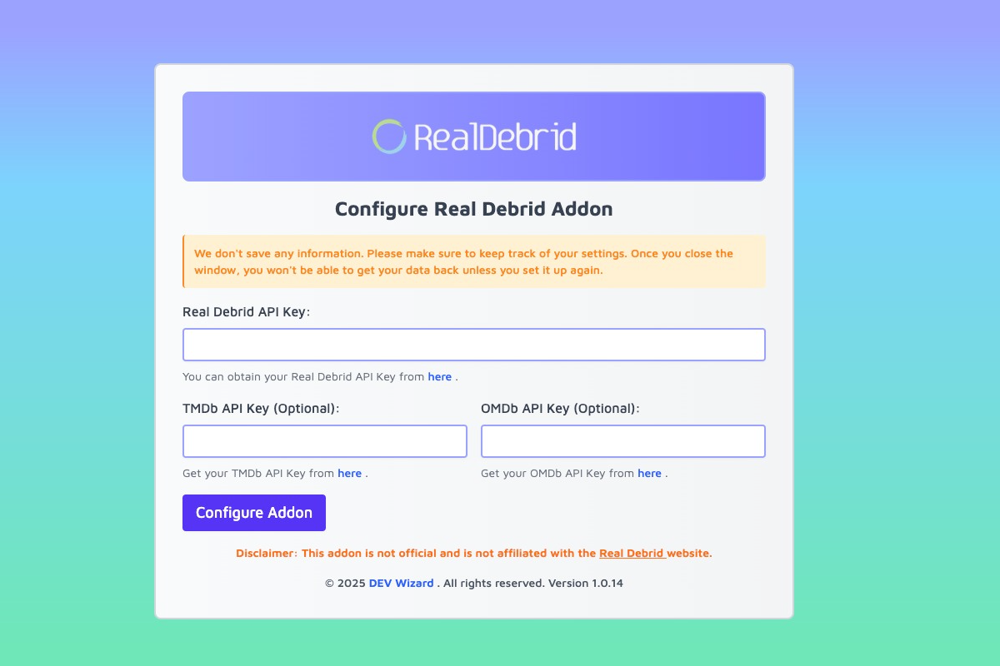
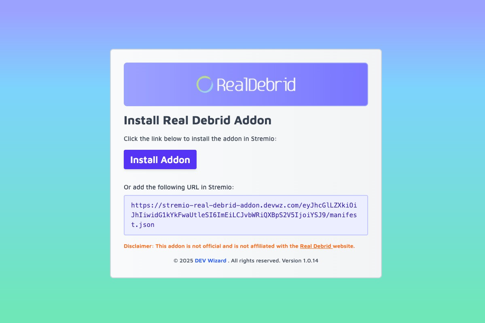
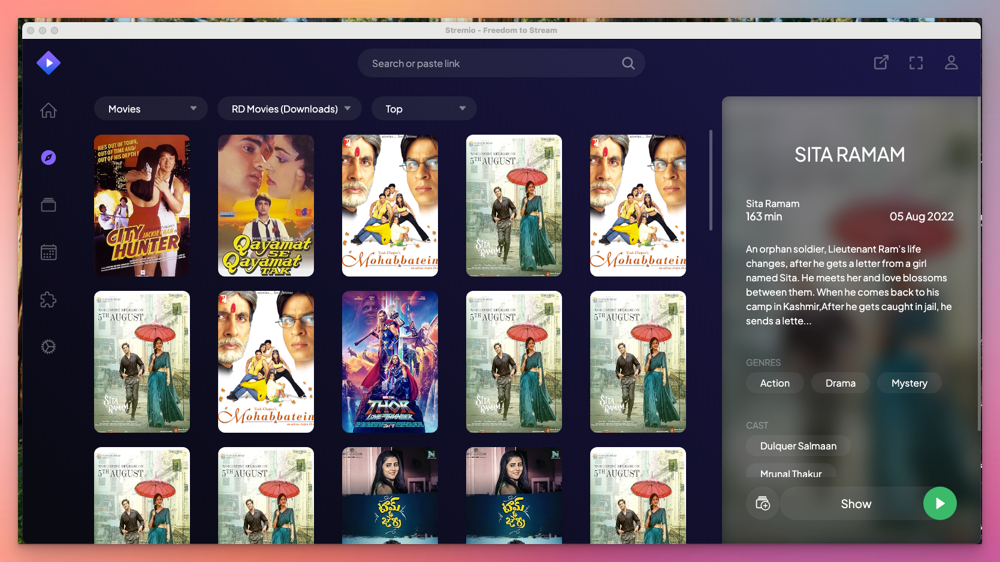

# Stremio Real Debrid Addon

Stream your Real Debrid files in Stremio.

**Disclaimer**: This addon is not official and is not affiliated with the
[Real Debrid](https://real-debrid.com/) website.







## Table of Contents

- [Stremio Real Debrid Addon](#stremio-real-debrid-addon)
  - [Table of Contents](#table-of-contents)
  - [Description](#description)
  - [Features](#features)
  - [Installation](#installation)
    - [Production Deployment](#production-deployment)
    - [Local Deployment](#local-deployment)
      - [Prerequisites](#prerequisites)
      - [Steps](#steps)
      - [Tailwind CSS Compilation](#tailwind-css-compilation)
  - [Configuration](#configuration)
  - [Usage](#usage)
  - [Docker and CI/CD](#docker-and-cicd)
  - [Nginx Proxy Configuration](#nginx-proxy-configuration)
    - [Step 1: Install Nginx](#step-1-install-nginx)
    - [Step 2: Create Nginx Configuration](#step-2-create-nginx-configuration)
    - [Step 3: Enable the Configuration](#step-3-enable-the-configuration)
    - [Step 4: Test Nginx Configuration](#step-4-test-nginx-configuration)
    - [Step 5: Configure Firewall (if necessary)](#step-5-configure-firewall-if-necessary)
    - [Step 6: Access the Addon](#step-6-access-the-addon)
  - [Contributing](#contributing)
  - [License](#license)
  - [Disclaimer](#disclaimer)

## Description

This Stremio addon allows you to stream your Real Debrid files directly in
Stremio. It provides access to torrents and downloads from your Real Debrid
account, pulls extended metadata from TMDb or OMDb, and offers multi-lingual
support for a richer viewing experience. The addon is designed to be performant,
with caching mechanisms in place for quicker repeated lookups.

## Features

- **Stream Real Debrid Torrents and Downloads**  
  Access your Real Debrid torrents and downloads directly within Stremio for
  both movies and TV series.

- **Extended Metadata Integration**  
  Retrieve additional content details from TMDb or OMDb. If you provide both API
  keys, the system can attempt multiple lookups to find the most comprehensive
  metadata.

- **Multi-Lingual Support**  
  Configure language preferences for a localized experience where metadata
  (title, overview, etc.) can be fetched in supported languages.

- **Enhanced Caching**  
  Common metadata and API results are cached to improve performance for repeated
  lookups.

- **API Key Security**  
  Environment variables are used for Real Debrid, TMDb, and OMDb API keys. No
  user data is stored on the server, and keys can be passed securely via
  environment settings.

- **Easy Configuration**  
  The `/configure` page offers a straightforward interface to enter or update
  API keys.

- **Tailwind CSS Styling**  
  The addon’s interface is styled using Tailwind CSS, allowing for quick design
  changes and consistent layouts.

- **Docker and CI/CD Ready**  
  Dockerfile and Docker Compose configurations are available for stable local or
  production deployments. These can be integrated into continuous integration
  pipelines for automated builds.

- **Nginx Proxy Support**  
  Detailed instructions are provided for running the addon behind an Nginx
  proxy.

## Installation

### Production Deployment

A public instance is available at the following URL:

[https://stremio-real-debrid-addon.devwz.com](https://stremio-real-debrid-addon.devwz.com)

Visit this link, configure your API keys, and install the addon in Stremio as
instructed on the page.

### Local Deployment

#### Prerequisites

- **Node.js** (v18 or higher)
- **NPM**

#### Steps

1. **Clone the repository**:

   ```bash
   git clone https://github.com/SHSharkar/Stremio-Real-Debrid-Addon.git
   ```

2. **Navigate to the project directory**:

   ```bash
   cd Stremio-Real-Debrid-Addon
   ```

3. **Install dependencies**:

   ```bash
   npm install
   ```

4. **Compile Tailwind CSS**:

   ```bash
   npx tailwindcss -i ./src/main.css -o ./dist/main.css --watch
   ```

   This watches for CSS changes and recompiles automatically.

5. **Start the addon**:

   ```bash
   npm start -- --launch
   ```

   The `--launch` flag opens the addon in your default browser.

6. **Configure the addon**:

   Navigate to [http://localhost:62316](http://localhost:62316/), then enter
   your Real Debrid API key and, optionally, TMDb and OMDb keys for extended
   metadata. You can also specify language preferences for multi-lingual
   support. Follow the on-screen instructions to install the addon in Stremio.

#### Tailwind CSS Compilation

To compile for production without watching:

```bash
npx tailwindcss -i ./src/main.css -o ./dist/main.css --minify
```

## Configuration

When configuring the addon, you will need:

- **REAL_DEBRID_API_KEY** (required)  
   Obtain from [Real Debrid](https://real-debrid.com/apitoken).
- **TMDB_API_KEY** (optional)  
   Retrieve from [TMDb](https://www.themoviedb.org/settings/api).
- **OMDB_API_KEY** (optional)  
   Obtain from [OMDb](https://www.omdbapi.com/apikey.aspx).

These can be set as environment variables or entered directly on the
`/configure` page. Your data is never saved on the server, so you will need to
re-enter keys if the configuration is cleared.

## Usage

After installation, your Real Debrid torrents and downloads appear as new
catalogs in Stremio. Caching enhances performance for subsequent lookups.
Multi-lingual data is fetched if you have provided the relevant API key(s) and
specified a supported language preference.

## Docker and CI/CD

This project includes a Dockerfile and `docker-compose.yml` to facilitate both
local testing and production deployment. Refer to `docker-instructions.md` for
step-by-step Docker usage. You can also integrate these setups into your CI/CD
pipelines for automated builds and deployments.

To deploy quickly:

```bash
docker compose up -d --build
```

Set environment variables (e.g., `REAL_DEBRID_API_KEY`, `TMDB_API_KEY`,
`OMDB_API_KEY`) either in your shell or via a `.env` file.

## Nginx Proxy Configuration

If you prefer running the addon behind an Nginx proxy, follow these steps:

### Step 1: Install Nginx

```bash
sudo apt update
sudo apt install nginx
```

### Step 2: Create Nginx Configuration

```bash
sudo nano /etc/nginx/sites-available/stremio-realdebrid
```

```nginx
server {
    listen 80;
    server_name your.domain.com;

    location / {
        proxy_pass http://127.0.0.1:62316;
        proxy_http_version 1.1;
        proxy_set_header Upgrade $http_upgrade;
        proxy_set_header Connection 'upgrade';
        proxy_set_header Host $host;
        proxy_cache_bypass $http_upgrade;
    }
}
```

Replace `your.domain.com` with your actual domain.

### Step 3: Enable the Configuration

```bash
sudo ln -s /etc/nginx/sites-available/stremio-realdebrid /etc/nginx/sites-enabled/
```

### Step 4: Test Nginx Configuration

```bash
sudo nginx -t
sudo systemctl restart nginx
```

### Step 5: Configure Firewall (if necessary)

Allow HTTP traffic on port 80 if your firewall is enabled.

### Step 6: Access the Addon

Visit `http://your.domain.com` in your browser. Configure your API keys and
install the addon in Stremio.

## Contributing

Contributions are welcome! Please fork this repository and submit a pull request
with your changes or improvements.

## License

This project is licensed under the MIT License. See the [LICENSE](LICENSE) file
for details.

## Disclaimer

This addon is not official and is not affiliated with the
[Real Debrid](https://real-debrid.com/) website.
